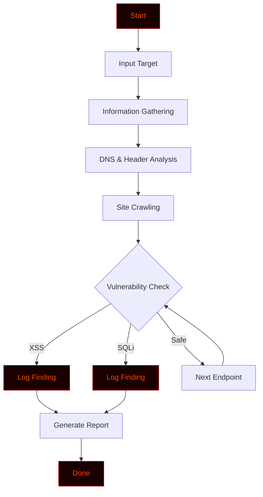

# Red_Hawk


cat << 'READMEEOF' > README.md
<p align="center">
  
  
  
  
  
</p>

<h1 align="center">🔴 RED HAWK v3.0</h1>
<h3 align="center">Ultimate OSINT Reconnaissance Framework</h3>

<p align="center">
  <b>Developer:</b> Maxod anonmoty 🔰<br>
  <b>GitHub:</b> <a href="https://github.com/anonmoty/Red_Hawk">github.com/anonmoty/Red_Hawk</a>
</p>

<p align="center">
  
</p>

---<!-- ═══════════════════════════════════════════════════════════════════════ -->
<!--                        RED_HAWK - README.md                             -->
<!--              Professional Hacker-Style Documentation                    -->
<!-- ═══════════════════════════════════════════════════════════════════════ -->

<div align="center">

<!-- Animated Header Banner -->


<!-- Typing Animation -->


<br>

<!-- Status Badges -->
<p>


</p>

<p>


</p>

<br>

<!-- Matrix Rain GIF -->


</div>

---

<div align="center">

```ascii
██████╗ ███████╗██████╗     ██╗  ██╗ █████╗ ██╗    ██╗██╗  ██╗
██╔══██╗██╔════╝██╔══██╗    ██║  ██║██╔══██╗██║    ██║██║ ██╔╝
██████╔╝█████╗  ██║  ██║    ███████║███████║██║ █╗ ██║█████╔╝ 
██╔══██╗██╔══╝  ██║  ██║    ██╔══██║██╔══██║██║███╗██║██╔═██╗ 
██║  ██║███████╗██████╔╝    ██║  ██║██║  ██║╚███╔███╔╝██║  ██╗
╚═╝  ╚═╝╚══════╝╚═════╝     ╚═╝  ╚═╝╚═╝  ╚═╝ ╚══╝╚══╝ ╚═╝  ╚═╝

                [ Recon | Scan | Hunt ]
```

</div>

---

## ⚠️ Legal Disclaimer

<div align="center">

```
╔══════════════════════════════════════════════════════════════════════╗
║                                                                      ║
║   RED_HAWK is an information gathering and vulnerability scanning    ║
║   tool built for EDUCATIONAL and AUTHORIZED testing purposes only.   ║
║                                                                      ║
║   ▸ Use ONLY on targets you have permission to test.                 ║
║   ▸ Unauthorized scanning is ILLEGAL.                                ║
║   ▸ Always follow the bug bounty program's scope and rules.          ║
║   ▸ The author is NOT responsible for any misuse.                    ║
║                                                                      ║
║   Hack responsibly. Hunt ethically. Report responsibly.              ║
║                                                                      ║
╚══════════════════════════════════════════════════════════════════════╝
```

</div>

---

## 🎯 Overview

> **RED_HAWK** is a powerful **information gathering and vulnerability scanning tool** written in PHP. It is designed for **penetration testers, bug bounty hunters, and security researchers** who need to collect intelligence about a target before exploitation.

Whether you're mapping a target's infrastructure or hunting for misconfigurations — RED_HAWK gives you the **recon advantage** you need.

---

## ✨ Core Features

<div align="center">

| | Feature | Description |
|:---:|:---|:---|
| 🕸️ | **Information Gathering** | Collects target intel efficiently |
| 🔍 | **Vulnerability Scanner** | Detects common security misconfigurations |
| 🌐 | **Site Crawling** | Maps internal and external links |
| 🛡️ | **Header Analysis** | Inspects HTTP response headers |
| 📡 | **DNS Lookup** | Resolves and maps DNS records |
| 🧪 | **XSS Detection** | Scans for cross-site scripting flaws |
| 💉 | **SQLi Detection** | Checks for injection vulnerabilities |
| 📊 | **Structured Output** | Clean, readable scan results |
| 🎨 | **Hacker Terminal UI** | Red-on-black aesthetic |
| ⚡ | **Fast Execution** | Lightweight and quick |

</div>

---

## 🧠 How It Works



1. **Input** — Takes the target URL
2. **Gather** — Collects all available information
3. **Analyze** — Checks DNS, headers, and responses
4. **Crawl** — Maps the site's internal structure
5. **Scan** — Tests for XSS, SQLi, and misconfigurations
6. **Report** — Displays structured findings

---

## 📁 Project Structure

```
RED_HAWK/
├── redhawk.php               # Main entry point
├── core/
│   ├── info.php              # Information gathering
│   ├── scanner.php           # Vulnerability scanner
│   ├── crawler.php           # Site crawler
│   └── reporter.php          # Report generator
├── payloads/
│   ├── xss.txt               # XSS payloads
│   └── sqli.txt              # SQLi payloads
├── reports/                  # Generated reports
├── LICENSE
└── README.md
```

---

## 📸 Demo

<div align="center">

```
╔═════════════════════════════════════════════════════════════╗
║  ██████╗ ███████╗██████╗     ██╗  ██╗ █████╗ ██╗    ██╗██╗  ██╗ ║
║  ██╔══██╗██╔════╝██╔══██╗    ██║  ██║██╔══██╗██║    ██║██║ ██╔╝ ║
║  ██████╔╝█████╗  ██║  ██║    ███████║███████║██║ █╗ ██║█████╔╝  ║
║  ██╔══██╗██╔══╝  ██║  ██║    ██╔══██║██╔══██║██║███╗██║██╔═██╗  ║
║  ██║  ██║███████╗██████╔╝    ██║  ██║██║  ██║╚███╔███╔╝██║  ██╗ ║
║  ╚═╝  ╚═╝╚══════╝╚═════╝     ╚═╝  ╚═╝╚═╝  ╚═╝ ╚══╝╚══╝ ╚═╝  ╚═╝ ║
╚═════════════════════════════════════════════════════════════╝

[✓] Target: https://target.com
[✓] Modules: Info | Scan | Crawl
[→] Gathering intel...

[████████████████████████░░░░░░] 80% | 800/1000 checks
[!] XSS Found: /search?q=
[!] SQLi Found: /login?id=
[✓] Scan complete in 6.12s
[✓] Report: reports/redhawk_2024.json

        Happy Hunting! 🎯
```

</div>

---

## 🎨 Hacker Terminal Theme

RED_HAWK uses a **deep red + neon orange** theme by default:

```python
THEME = {
    "primary":   "\033[38;5;196m",  # Bright Red
    "secondary": "\033[38;5;202m",  # Orange
    "accent":    "\033[38;5;214m",  # Amber
    "error":     "\033[38;5;196m",  # Red
    "warning":   "\033[38;5;220m",  # Yellow
    "info":      "\033[38;5;202m",  # Orange
    "reset":     "\033[0m",         # Reset
}
```

---

## 🔥 Power User Tips

### Combine with Other Tools

```bash
# Red_Hawk + subdomain enumeration
subfinder -d target.com | httpx | while read url; do
    php redhawk.php -u "$url"
done

# Red_Hawk + nuclei
php redhawk.php -u https://target.com -o recon.json
nuclei -u https://target.com -t ~/nuclei-templates/
```

### Speed Optimization

```bash
# Stealth mode (slower but safer)
php redhawk.php -u https://target.com --delay 2

# Full power mode
php redhawk.php -u https://target.com --threads 20
```

---

## 🐛 Bug Bounty Workflow

RED_HAWK fits perfectly into your recon pipeline:

```
1. Subdomain Enumeration  →  amass / subfinder
2. Live Host Detection    →  httpx
3. Information Gathering  →  RED_HAWK  ← you are here
4. Endpoint Analysis      →  grep, waybackurls
5. Vulnerability Scanning →  nuclei, XSStrike
6. Manual Testing         →  Burp Suite
```

### Use Cases for Hunters

- 🔍 **Information gathering** on any target
- 📜 **DNS and header analysis** for recon
- 🗺️ **Site crawling** for hidden endpoints
- 🧪 **XSS and SQLi detection** in one tool
- 📊 **Structured reports** for documentation

---

## 🗺️ Roadmap

- [x] Information gathering
- [x] Vulnerability scanning
- [x] Site crawling
- [x] Hacker terminal UI
- [ ] JavaScript secret scanner
- [ ] Wayback Machine integration
- [ ] Subdomain auto-discovery
- [ ] Docker image
- [ ] Web dashboard

---

## 🤝 Contributing

Contributions are welcome. Please follow these steps:

1. Fork the repository
2. Create your branch (`git checkout -b feature/amazing-feature`)
3. Commit your changes (`git commit -m 'Add amazing feature'`)
4. Push to the branch (`git push origin feature/amazing-feature`)
5. Open a Pull Request

---

## 📜 License

Distributed under the **MIT License**. See [`LICENSE`](LICENSE) for more information.

---

## 🙏 Credits

- **Author:** [@anonmoty](https://github.com/anonmoty)
- **Inspired by:** The original RED_HAWK by Tuhinshubhra
- **Built with:** PHP, caffeine, and curiosity ☕

---

<div align="center">


<br><br>

### ⭐ If this tool helped you in your hunt, drop a star!


</div>


## 📖 Description

**RED HAWK** is a powerful, multi-threaded **OSINT (Open Source Intelligence)** reconnaissance framework designed for **security professionals, penetration testers, bug bounty hunters, and cybersecurity students**.

It automates the information gathering phase of security assessments by collecting **publicly available data** about a target domain through **18+ integrated modules** — all from a single interactive terminal interface.

> ⚠️ **DISCLAIMER:** This tool is built for **educational and authorized security testing purposes only**. The developer is **NOT responsible** for any misuse or illegal activity. Always obtain **written permission** before testing any target.

---

## ✨ Key Features

| Feature | Description |
|---------|-------------|
| 🎯 **18+ OSINT Modules** | WHOIS, DNS, Subdomains, Headers, GeoIP, Ports, SSL, and more |
| ⚡ **Multi-Threaded Scanning** | Port scanner & subdomain brute-force with 50 concurrent threads |
| 📊 **Auto Report Generation** | Exports results in **JSON**, **HTML**, and **TXT** formats |
| 🔍 **Subdomain Enumeration** | 4 methods: DNS Brute, crt.sh, HackerTarget, RapidDNS |
| 🛡️ **Security Headers Audit** | HSTS, CSP, XFO, XCTO scoring with grade (A+ to F) |
| 🔐 **SSL/TLS Analysis** | Certificate details, expiry check, cipher suite info |
| 🏗️ **CMS Detection** | WordPress, Joomla, Drupal, Magento, Shopify, PrestaShop |
| 🛡️ **WAF Detection** | 14+ firewall signatures (Cloudflare, AWS, Akamai, etc.) |
| 🔗 **CORS Misconfiguration** | 5 origin-based tests for CORS vulnerabilities |
| 🖱️ **Clickjacking Test** | X-Frame-Options & CSP check with PoC generation |
| 📧 **Email Harvester** | Scraping + pattern-based email discovery |
| 📜 **Wayback Machine** | Historical URLs from Archive.org CDX API |
| 🕷️ **Link Crawler** | Internal/External links + resources + forms |
| 🔄 **Reverse IP Lookup** | Find all domains hosted on same IP |
| 📱 **Social Media Finder** | 11 platforms (Twitter, GitHub, LinkedIn, etc.) |
| 🤖 **Robots.txt Analysis** | Disallowed paths + sitemap extraction |
| 🌍 **IP Geolocation** | Country, City, ISP, Coordinates, Maps link |
| 🎨 **Beautiful CLI** | Colored output, progress bars, interactive menu |
| 📱 **Termux Compatible** | Fully optimized for Android/Termux |

---

## 📁 Project Structure


🔰 About Developer
Info	Details
Name	Maxod anonmoty
GitHub	@anonmoty
Tool	RED HAWK v3.0
Purpose	Educational & Authorized Security Testing


---

## 🚀 Installation

### Termux (Android)

```bash
# Update packages
pkg update && pkg upgrade -y

# Install dependencies
pkg install python git

# Clone the repository
git clone https://github.com/anonmoty/Red_Hawk.git

# Navigate to directory
cd Red_Hawk
#fikw.list 

ls

# Install Python packages
pip install -r requirements.txt

# Run the tool
python start.py

